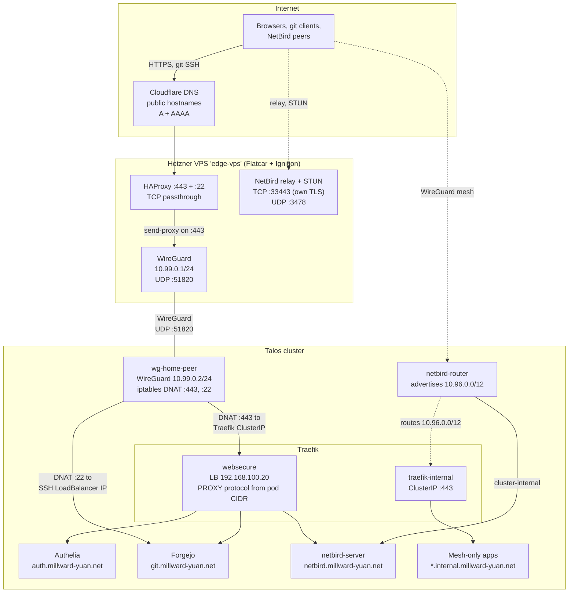

# Homelab

Configuration for my homelab. Cluster nodes run [Talos Linux](https://www.talos.dev/), a Hetzner VPS running [Flatcar](https://www.flatcar.org/) is the public edge, and [Pulumi](https://www.pulumi.com/) (TypeScript) manages both.

## Structure

```
stacks/
  talos/       Cluster bootstrap and lifecycle (Talos and Kubernetes upgrades)
  vps/         Hetzner edge VPS: public tunnel, NetBird relay and STUN
  platform/    Cluster services: storage, ingress, auth, NetBird, Forgejo, registry
  apps/        User applications
lib/           Shared constants, types and version pins
images/        Dockerfiles for self-built images
scripts/       Helpers for the Justfile and CI
.forgejo/      Forgejo Actions workflows: typecheck, image builds, Renovate
```

## Network



**Public traffic** reaches home Traefik through the VPS. Cloudflare points each public hostname at the VPS Primary IP. HAProxy binds :443 in TCP mode and forwards the raw stream over the WireGuard tunnel with the PROXY protocol, so home Traefik terminates the TLS. The `wg-home-peer` pod DNATs :443 to Traefik's ClusterIP. Traefik trusts the PROXY protocol header only from the pod CIDR (10.244.0.0/16), which is the tunnel pod's source address after masquerading.

**Forgejo SSH** uses the same tunnel. HAProxy forwards :22 without the PROXY protocol, and `wg-home-peer` DNATs it to Forgejo's SSH LoadBalancer IP. The VPS masks its own `sshd` so that HAProxy can bind the port.

**Mesh-only apps** live under `*.internal.millward-yuan.net` and are reachable only through NetBird. The [NetBird README](stacks/platform/netbird/README.md) covers the mesh DNS, relay and authentication setup.

## Prerequisites

- [Pulumi CLI](https://www.pulumi.com/docs/install/)
- [1Password CLI](https://developer.1password.com/docs/cli/) (`op`): `just pulumi` reads the stack passphrases and Garage credentials from it
- [just](https://github.com/casey/just)
- [pnpm](https://pnpm.io/)
- [talosctl](https://www.talos.dev/latest/talos-guides/install/talosctl/)
- [kubectl](https://kubernetes.io/docs/tasks/tools/)
- [wireguard-tools](https://www.wireguard.com/install/) (`wg`): the VPS stack generates its WireGuard keypairs locally
- [buildah](https://buildah.io/): only when `just images` finds an image to build

## Getting started

Install dependencies and initialise the Pulumi stacks:

```bash
just install    # Install pnpm dependencies for all stacks
just init       # Initialise Pulumi stacks (run once)
```

## Justfile recipes

- `just up`: Deploy all stacks in order (talos, vps, platform, apps)
- `just up platform`: Deploy a single stack
- `just preview`: Preview changes across all stacks
- `just preview talos`: Preview a single stack
- `just destroy`: Destroy all stacks in reverse order
- `just pulumi talos <command>`: Run any Pulumi command against a stack
- `just kubeconfig`: Overwrite `~/.kube/config` with the cluster kubeconfig
- `just talosconfig`: Overwrite `~/.talos/config` with the cluster talosconfig
- `just images`: Build and push any `images/*` that the registry does not have yet
- `just define-image <key> <image:tag>`: Pin an image by digest in `lib/version-pins.json`
- `just regenerate-netbird-sdk`: Regenerate the NetBird Pulumi SDK after a version bump
- `just flatcar-versions`: Show the latest Flatcar release on each channel

`just up` runs `just images` first whenever it deploys platform. The registry is mesh-only, so this needs a NetBird connection. Without one, `just images` fails and `just up` carries on with a warning.

Recipes for rare operational fixes live in `runbook.justfile`. List them with `just --justfile runbook.justfile`.

## Adding a node

1. Create a schematic YAML if new hardware: `stacks/talos/schematics/<name>.yaml`
2. Add an entry to `stacks/talos/Pulumi.homelab.yaml` under `nodes`
3. Boot the node from the Talos ISO
4. Run `just up talos`

## Upgrades

Talos and Kubernetes versions are configured in `stacks/talos/Pulumi.homelab.yaml`. Bumping the version and running `just up talos` will upgrade the cluster. The upgrade scripts short-circuit if the running version already matches the target, so re-runs are safe and fast.

## Dependency updates

Renovate runs daily from a Forgejo Actions workflow. Helm chart, image and Go module versions live in `lib/version-pins.json`, and Renovate manages them alongside the npm dependencies. It waits 14 days after a release before it proposes one. Patch and minor updates merge automatically for `stacks/platform`, `stacks/apps`, `images/` and the version pins. Updates under `stacks/talos` or `stacks/vps`, and every major update, wait for a manual merge.
