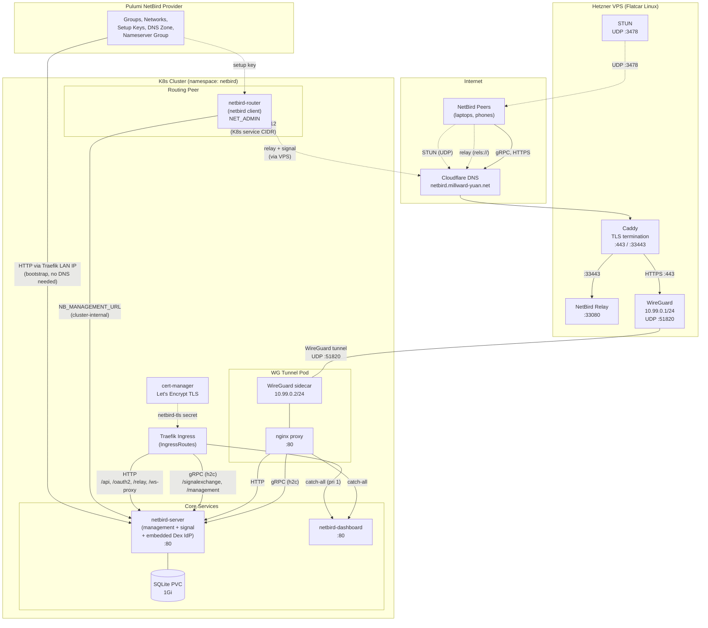

# NetBird Stack

Self-hosted [NetBird](https://netbird.io) zero-trust networking with an optional
Hetzner VPS for public relay/STUN and ingress.

## Architecture



### Traffic flows

**LAN clients** connect via Traefik IngressRoutes on the local network.
Traefik terminates TLS and routes by path: gRPC for signal/management (h2c),
HTTP for the API/OAuth/relay/WebSocket, and a catch-all for the dashboard.

**Remote clients** connect through the VPS. Cloudflare DNS points
`netbird.millward-yuan.net` to the Hetzner VPS, where Caddy terminates TLS and
forwards traffic over a WireGuard tunnel (10.99.0.0/24) to the `wg-home-peer`
pod in the cluster. An nginx sidecar in that pod performs the same path-based
routing as Traefik (gRPC vs HTTP vs dashboard).

**Relay and STUN** run on the VPS for NAT traversal. The relay container
listens on :33080, exposed via Caddy on :33443 with TLS. STUN runs on
UDP :3478 directly on the VPS.

**K8s service routing** is provided by the `netbird-router` pod, which joins
the NetBird network as a peer and advertises the cluster service CIDR
(10.96.0.0/12) with masquerading, allowing remote NetBird peers to reach
in-cluster services. A `NameserverGroup` directs peers to resolve
`millward-yuan.net` via CoreDNS (10.96.0.10), routed through the same path.

### Deployment order

1. Server + dashboard + Traefik IngressRoutes + TLS cert
2. NetBird API config via Pulumi provider (groups, networks, DNS zone, setup key)
3. Router peer (uses setup key from step 2)
4. WireGuard tunnel pod (if VPS stack is configured)

## Runbooks

### VPS recreated / IP changed

The WireGuard tunnel pod has the VPS IP baked into its config at deploy time.
If the VPS is recreated (e.g. via `just up vps`) and gets a new IP:

1. **Sync the new IP into cluster config:**
   ```
   just up platform
   ```

2. **Restart the WireGuard tunnel pod** (picks up new VPS endpoint):
   ```
   kubectl rollout restart deployment/wg-home-peer -n netbird
   kubectl rollout status deployment/wg-home-peer -n netbird
   ```

3. **Restart the routing peer** (re-registers with management once tunnel is up):
   ```
   kubectl rollout restart deployment/netbird-router -n netbird
   kubectl rollout status deployment/netbird-router -n netbird
   ```

`netbird-server` does not need restarting — its PVC data lives in the cluster
and its config uses the domain name (`netbird.millward-yuan.net`), not the raw
VPS IP.
