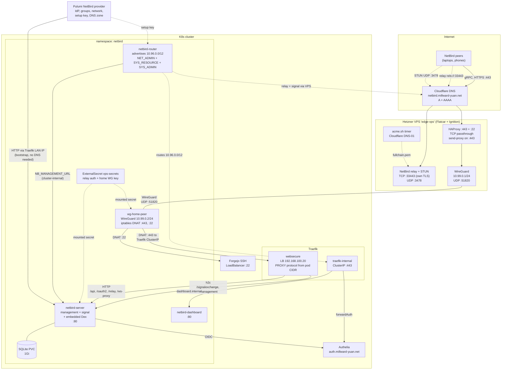

# NetBird Stack

Self-hosted [NetBird](https://netbird.io) zero-trust networking. A Hetzner VPS
provides the public edge: relay, STUN, and a TCP tunnel that publishes home
Traefik to the internet.

## Architecture


```mermaid
graph TB
    subgraph Internet
        peers["NetBird peers<br/>(laptops, phones)"]
        dns["Cloudflare DNS<br/>netbird.millward-yuan.net<br/>A + AAAA"]
    end

    subgraph VPS ["Hetzner VPS 'edge-vps' (Flatcar + Ignition)"]
        haproxy["HAProxy :443 + :22<br/>TCP passthrough<br/>send-proxy on :443"]
        relay["NetBird relay + STUN<br/>TCP :33443 (own TLS)<br/>UDP :3478"]
        acme["acme.sh timer<br/>Cloudflare DNS-01"]
        wg_vps["WireGuard<br/>10.99.0.1/24<br/>UDP :51820"]
    end

    subgraph K8s ["K8s cluster"]
        subgraph ingress ["Traefik"]
            traefik["websecure<br/>LB 192.168.100.20<br/>PROXY protocol from pod CIDR"]
            internal["traefik-internal<br/>ClusterIP :443"]
        end

        subgraph nb ["namespace: netbird"]
            wg_home["wg-home-peer<br/>WireGuard 10.99.0.2/24<br/>iptables DNAT :443, :22"]
            server["netbird-server<br/>management + signal<br/>+ embedded Dex<br/>:80"]
            dashboard["netbird-dashboard<br/>:80"]
            pvc[("SQLite PVC<br/>1Gi")]
            router["netbird-router<br/>advertises 10.96.0.0/12<br/>NET_ADMIN + SYS_RESOURCE + SYS_ADMIN"]
            eso["ExternalSecret vps-secrets<br/>relay auth + home WG key"]
        end

        authelia["Authelia<br/>auth.millward-yuan.net"]
        forgejo_ssh["Forgejo SSH<br/>LoadBalancer :22"]
    end

    api_config["Pulumi NetBird provider<br/>IdP, groups, network,<br/>setup key, DNS zone"]

    %% Peer connections
    peers -- "gRPC, HTTPS :443" --> dns
    peers -. "relay rels://:33443" .-> dns
    peers -. "STUN UDP :3478" .-> dns
    dns --> haproxy
    dns --> relay

    %% VPS internals
    acme -. "fullchain.pem" .-> relay
    haproxy --> wg_vps

    %% Tunnel
    wg_vps -- "WireGuard<br/>UDP :51820" --- wg_home
    wg_home -- "DNAT :443 to<br/>Traefik ClusterIP" --> traefik
    wg_home -- "DNAT :22" --> forgejo_ssh

    %% Traefik routing
    traefik -- "h2c<br/>/signalexchange, /management" --> server
    traefik -- "HTTP<br/>/api, /oauth2, /relay, /ws-proxy" --> server
    internal -- "forwardAuth" --> authelia
    internal -- "dashboard.internal" --> dashboard

    %% Server internals
    server --- pvc
    server -- "OIDC" --> authelia
    eso -. "mounted secret" .-> server
    eso -. "mounted secret" .-> wg_home

    %% Router
    router -- "NB_MANAGEMENT_URL<br/>(cluster-internal)" --> server
    router -. "relay + signal via VPS" .-> dns
    router -. "routes 10.96.0.0/12" .-> internal

    %% API config
    api_config -- "HTTP via Traefik LAN IP<br/>(bootstrap, no DNS needed)" --> server
    api_config -. "setup key" .-> router
```

### Traffic flows

**Public traffic** reaches home Traefik through the VPS. Cloudflare points
`netbird.millward-yuan.net` (and every other public app hostname) at the VPS
Primary IP. HAProxy binds :443 in TCP mode and forwards the raw stream over the
WireGuard tunnel with the PROXY protocol, so home Traefik terminates the TLS.
The `wg-home-peer` pod DNATs :443 to Traefik's ClusterIP. Traefik trusts the
PROXY protocol header only from the pod CIDR (10.244.0.0/16), which is the
tunnel pod's source address after masquerading.

**Forgejo SSH** uses the same tunnel. HAProxy forwards :22 without the PROXY
protocol, and `wg-home-peer` DNATs it to Forgejo's SSH LoadBalancer IP. The VPS
masks its own `sshd` so that HAProxy can bind the port.

**The NetBird API and signal** are served on `netbird.millward-yuan.net` by
IngressRoutes on the `websecure` entrypoint: h2c for the signal and management
gRPC paths, plain HTTP for `/api`, `/oauth2`, `/relay`, and `/ws-proxy/`.

**Relay and STUN** run in one container on the VPS, outside the tunnel. The
relay terminates its own TLS on :33443 with a certificate that an `acme.sh`
systemd timer issues and renews via Cloudflare DNS-01. STUN shares the process
on UDP :3478.

**Mesh-only services** live under `*.internal.millward-yuan.net`. A NetBird DNS
zone resolves those names to the `traefik-internal` ClusterIP, which is only
reachable through the `netbird-router` peer that advertises the cluster service
CIDR (10.96.0.0/12) with masquerading. There is no LAN or public path to them.
The NetBird dashboard and the image registry both sit here, each behind
Authelia's forwardAuth middleware. A `NameserverGroup` points peers at CoreDNS
(10.96.0.10) for that domain, routed the same way.

**Bootstrap access** uses its own IngressRoute on the `web` entrypoint. The
Pulumi NetBird provider talks to the API over HTTP at Traefik's LAN IP, because
public DNS points at a VPS that cannot proxy back until this same stack has
deployed the tunnel.

### Authentication

Authelia is the identity provider. The stack registers it through
`netbird.IdentityProvider`, and the server's embedded Dex federates to it. The
server's own local email login is disabled (`localAuthDisabled: true`).

Dex stores Authelia's client ID and secret in its SQLite store and does not
reload them on a rotation. A `DeploymentPatch` carries a hash of those
credentials and restarts the pod when they change. The restart is a separate
resource because the identity provider depends on the Deployment already
running. A hash on the Deployment itself would close a dependency cycle.

The server pod carries a `hostAliases` entry mapping `auth.millward-yuan.net` to
Traefik's static LoadBalancer IP, so in-cluster OIDC calls do not leave the LAN.

### Secrets

The relay auth secret and the home WireGuard private key originate in the VPS
stack and are read back through an `ExternalSecret` (1Password via ESO) as
`vps-secrets`. Both the server and the tunnel pod mount that secret and render
their config at start-up with `sed`, which keeps the values out of ConfigMaps
and out of the rendered manifests.

### Deployment order

1. Server, dashboard, IngressRoutes, TLS certificate
2. NetBird API config via the Pulumi provider (IdP, groups, network, DNS zone, setup key)
3. Router peer, using the setup key from step 2
4. WireGuard tunnel pod

## Runbooks

### VPS recreated / IP changed

The VPS holds a Hetzner Primary IP, which survives server replacement, so a
rebuild keeps the same address. The tunnel pod bakes the VPS IP and public key
into its config at deploy time, so when either one changes:

1. **Sync the new values into cluster config:**
   ```
   just up platform
   ```

2. **Restart the tunnel and routing pods:**
   ```
   just --justfile runbook.justfile netbird-bounce-vps
   ```

`netbird-server` does not need restarting. Its PVC data lives in the cluster,
and its config reaches the VPS by domain name.
